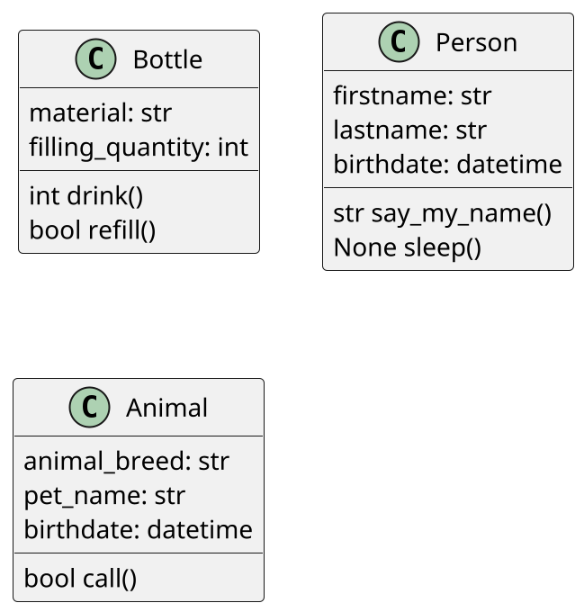

# Klassen in Python
Klassen sind maßgeschneiderte Datenstrukturen, die von uns beliebig erweitert werden können.

Es werden meist reale Dinge aus unserem Leben abstrahiert und in Klassen überführt.

D.h. jedes Objekt (=Klasse) hat mehrere Eigenschaften. Eine Flasche hat beispielsweise ein Material und Füllmenge.

Zu den Eigenschaften kann man auch noch Methoden (=Funktionen) für die Klasse erstellen.

So kann eine Person beispielsweise ihren Namen sagen. Hier könnte die Methode say_my_name() heißen.

Im Idealfall gibt man gleich den Rückgabewert einer Methode an. Hier können wir ganz normale Datentypen wie:
  * String
  * Bool
  * Integer 

... verwenden, oder auch komplexe Datentypen wie Klassen selbst.

Hier ein paar Beispiele:



## Was könnten wir hier im Klassenraum noch als Klasse beschreiben?
Schau dich im Raum um und versuche ein paar Gegenstände als Klasse zu definieren. Welche Eigenschaften haben diese Gegenstände?

Versuche zuerst diese Klassen als Klassendiagramm in UML umzusetzen. Beispiele dafür findest du oben.

Wir verwenden hier [PlantUML](https://plantuml.com/de/class-diagram).

# Wie werden Klassen in Python geschrieben?
## "Alte" Methode
```python
class Person:
    def __init__(self, firstname: str, lastname: str):
        self.firstname = firstname
        self.lastname = lastname
        
    def say_my_name(self) -> str:
        return f"My name is {self.firstname} {self.lastname}."

```

## Neue Methode (dataclasses)
```python
from dataclasses import dataclass

@dataclass
class Person:
    firstname: str
    lastname: str

    def say_my_name(self) -> str:
        return f"My name is {self.firstname} {self.lastname}."
```

### Was bedeutet self?
Self ist der Zeiger auf die Klasse selbst. Es muss bei jeder Methode als erstes Argument angegeben werden.

Wenn man die Methode aufruft, dann werden immer alle anderen Argumente bis auf das `self` übergeben.

Innerhalb von Methoden kann man dann über `self.variablenname` auf die Variable zugreifen.

D.h. wenn man eine Eigenschaft `firstname` definiert, dann kann man in anderen Methoden der gleichen Klasse auf die Variabel über `self.firstname` zugreifen. 

## Instanzen
Klassen alleine sind Schablonen für Gegenstände, Personen, etc.

Instanzen sind mit Leben befüllte Klassen. D.h. diese Klassen werden mit Werten befüllt, mit denen man dann weiterarbeiten kann.

### Beispiel Instanzen erstellen
```python
person1 = Person(firstname="Rainer", lastname="A.")
person2 = Person(firstname="Ulrike", lastname="S.")
person3 = Person(firstname="Klemens", lastname="F.")
```

### Beispiel Instanzen verwenden
```python
print(person1.say_my_name())
print(person2.say_my_name())
print(person3.say_my_name())
```