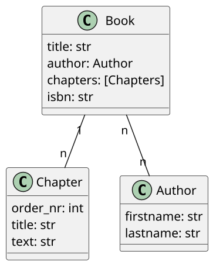
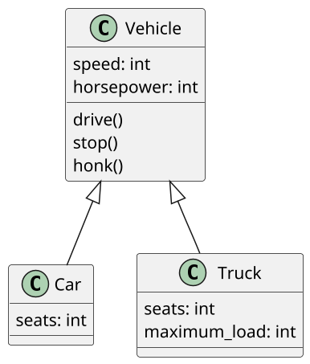
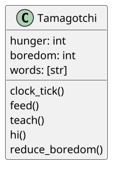

# Hier ein paar Beispiele zum selbst überlegen

Versuch dich selbst an einem der Beispiele. Wie sieht deine Lösung aus?

## Bücher


## Vokabeltrainer
````plantuml
@startuml
scale 3
class Dictionary {
language_name: str
words: [Word]
}

class Word {
word: str
translated_word: str
check_translated_word(translated_word: str)
}
Dictionary "n" -- "n" Word
@enduml
````

## Autos



## Tamagotchi

